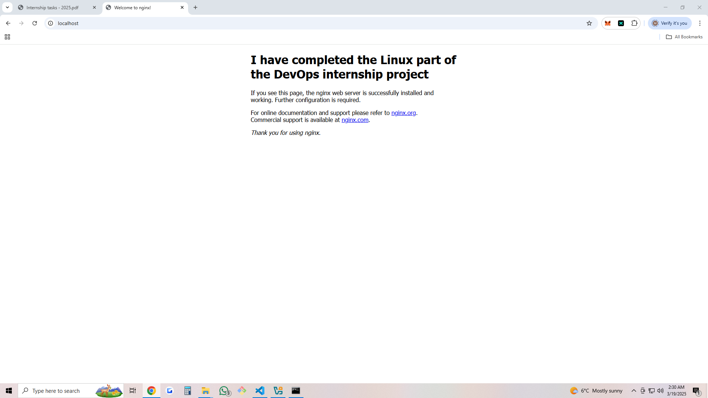

Task 1 - Linux essentials

1) Lookup the Public IP of cloudflare.com
Approach used: I used the command "dig cloudflare.com", and found out that the ip adresses associated are: 104.16.132.229 and 104.16.133.229.

Verify: 
    ```sh
    vagrant@ubuntu-jammy:~$ dig cloudflare.com

    ; <<>> DiG 9.18.30-0ubuntu0.22.04.2-Ubuntu <<>> cloudflare.com
    ;; global options: +cmd
    ;; Got answer:
    ;; ->>HEADER<<- opcode: QUERY, status: NOERROR, id: 20029
    ;; flags: qr rd ra; QUERY: 1, ANSWER: 2, AUTHORITY: 0, ADDITIONAL: 1

    ;; OPT PSEUDOSECTION:
    ; EDNS: version: 0, flags:; udp: 65494
    ;; QUESTION SECTION:
    ;cloudflare.com.                        IN      A

    ;; ANSWER SECTION:
    cloudflare.com.         297     IN      A       104.16.132.229
    cloudflare.com.         297     IN      A       104.16.133.229

    ;; Query time: 15 msec
    ;; SERVER: 127.0.0.53#53(127.0.0.53) (UDP)
    ;; WHEN: Tue Mar 18 21:00:55 UTC 2025
    ;; MSG SIZE  rcvd: 75
    ```


2) Map IP address 8.8.8.8 to hostname google-dns
Approach used: Added the line "8.8.8.8 google-dns" in the /etc/hosts file.

Verify: 
    ```sh 
    ping google-dns works fine.

    vagrant@ubuntu-jammy:~$ ping google-dns
    PING google-dns (8.8.8.8) 56(84) bytes of data.
    64 bytes from google-dns (8.8.8.8): icmp_seq=1 ttl=255 time=18.8 ms
    64 bytes from google-dns (8.8.8.8): icmp_seq=2 ttl=255 time=19.2 ms
    64 bytes from google-dns (8.8.8.8): icmp_seq=3 ttl=255 time=19.4 ms
    ```


3) Check if the DNS Port is Open for google-dns
Approach used: I used the command "nc -zv google-dns 53", which returned the message:

Connection to google-dns (8.8.8.8) 53 port [tcp/domain] succeeded!

4) Modify the System to Use Google’s Public DNS:
    4.1) Change the nameserver to 8.8.8.8 instead of the default local
    configuration.

    Approach used: I modified the line from file /etc/resolv.conf from "localhost 127.0.0.53" to "8.8.8.8".

    

    4.2) Perform another public IP lookup for cloudflare.com and compare the
    results.

    Results: 

    ```sh
    root@ubuntu-jammy:/etc/bind# root@ubuntu-jammy:/etc/bind# dig cloudflare.com

    ; <<>> DiG 9.18.30-0ubuntu0.22.04.2-Ubuntu <<>> cloudflare.com
    ;; global options: +cmd
    ;; Got answer:
    ;; ->>HEADER<<- opcode: QUERY, status: NOERROR, id: 50292
    ;; flags: qr rd ra ad; QUERY: 1, ANSWER: 2, AUTHORITY: 0, ADDITIONAL: 1

    ;; OPT PSEUDOSECTION:
    ; EDNS: version: 0, flags:; udp: 512
    ;; QUESTION SECTION:
    ;cloudflare.com.                        IN      A

    ;; ANSWER SECTION:
    cloudflare.com.         300     IN      A       104.16.133.229
    cloudflare.com.         300     IN      A       104.16.132.229

    ;; Query time: 35 msec
    ;; SERVER: 8.8.8.8#53(8.8.8.8) (UDP)
    ;; WHEN: Wed Mar 19 09:03:45 UTC 2025
    ;; MSG SIZE  rcvd: 75 
    ```


    Conclusion: The "SERVER: 8.8.8.8#53(8.8.8.8)" line confirms that queries are now directly resolved by Google's DNS.

    
5) Install and verify that Nginx service is running

Approach used:
    ```
    sudo apt update
    sudo apt install nginx
    ```

Verifying:
    ```
    root@ubuntu-jammy:/etc/bind# curl localhost
    <!DOCTYPE html>
    <html>
    <head>
    <title>Welcome to nginx!</title>
    <style>
        body {
            width: 35em;
            margin: 0 auto;
            font-family: Tahoma, Verdana, Arial, sans-serif;
        }
    </style>
    </head>
    <body>
    <h1>Welcome to nginx!</h1>
    <p>If you see this page, the nginx web server is successfully installed and
    working. Further configuration is required.</p>

    <p>For online documentation and support please refer to
    <a href="http://nginx.org/">nginx.org</a>.<br/>
    Commercial support is available at
    <a href="http://nginx.com/">nginx.com</a>.</p>

    <p><em>Thank you for using nginx.</em></p>
    </body>
    </html>
    ```

6) Find the Listening Port for Nginx

Approach used:
    ```
    root@ubuntu-jammy:/etc/bind# netstat -tulnp | grep nginx
    tcp        0      0 0.0.0.0:80              0.0.0.0:*               LISTEN      3084/nginx: master
    tcp6       0      0 :::80                   :::*                    LISTEN      3084/nginx: master
    ```

Conclusion: NGINX listens on port 80

Bonus / Nice to Have:
7) Change the Nginx Listening port to 8080
Approach used: I modified the file from /etc/nginx/sites-enabled/default. I edited the lines from
    ```
    server {
            listen 80 default_server;
            listen [::]:80 default_server;
    ```

    to

    ```
    server {
            listen 8080 default_server;
            listen [::]:8080 default_server;
    ```

    Verify:
    ```
    root@ubuntu-jammy:/etc/nginx/sites-enabled# sudo service nginx restart

    root@ubuntu-jammy:/etc/nginx/sites-enabled# netstat -tulnp | grep nginx
    tcp        0      0 0.0.0.0:8080            0.0.0.0:*               LISTEN      3212/nginx: master
    tcp6       0      0 :::8080                 :::*                    LISTEN      3212/nginx: master
    ```

    As we can see, the nginx service listens on port 8080.


8) Modify the default HTML page title from: "Welcome to nginx!" → "I have completed the Linux part of the DevOps internship project"

Approach used: I modified the HTML file from /var/www/html, now being structured as:

    ```
    <!DOCTYPE html>
    <html>
    ...
    <h1>I have completed the Linux part of the DevOps internship project</h1>
    ...
    </html>
    ```

Verify:
    

Personal bonus:
    I did this task on a ubuntu VM, hosted on vagrant. I added a portforward config to the vagrant file to allow me to use localhost from local, with the command:
    ```
    config.vm.network "forwarded_port", guest: 8080, host: 80
    ```