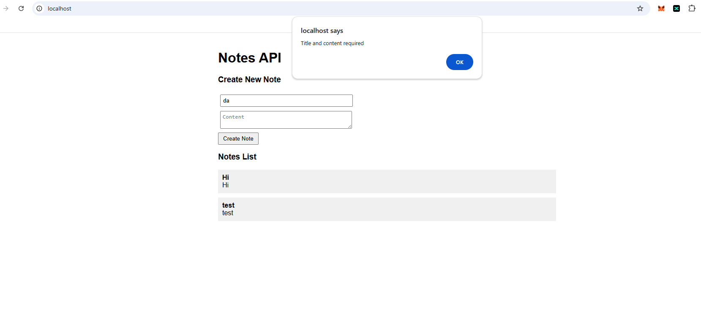
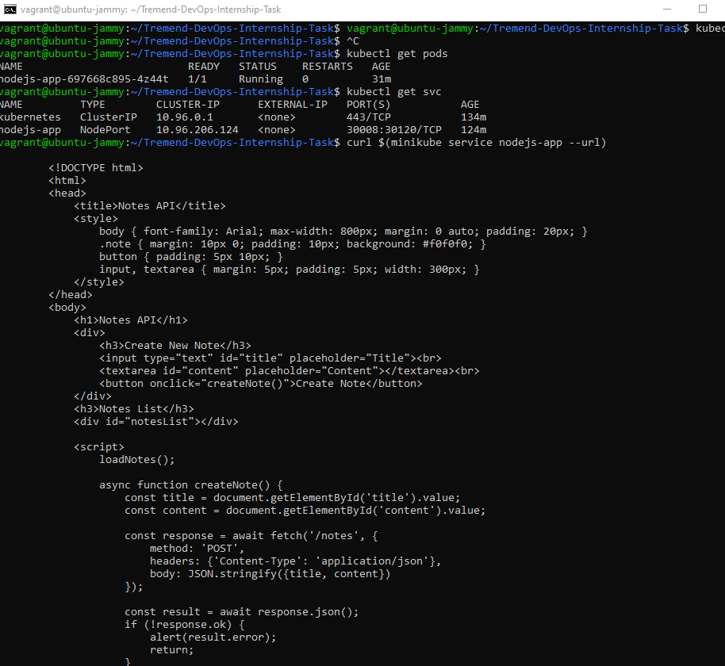
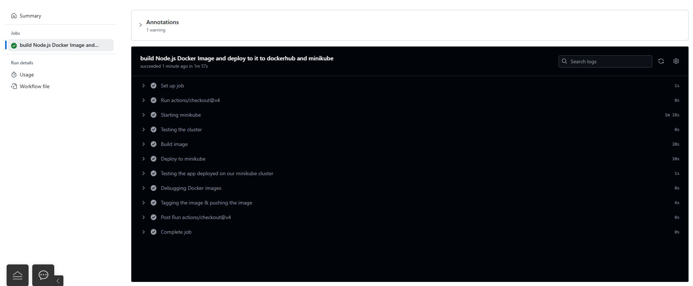
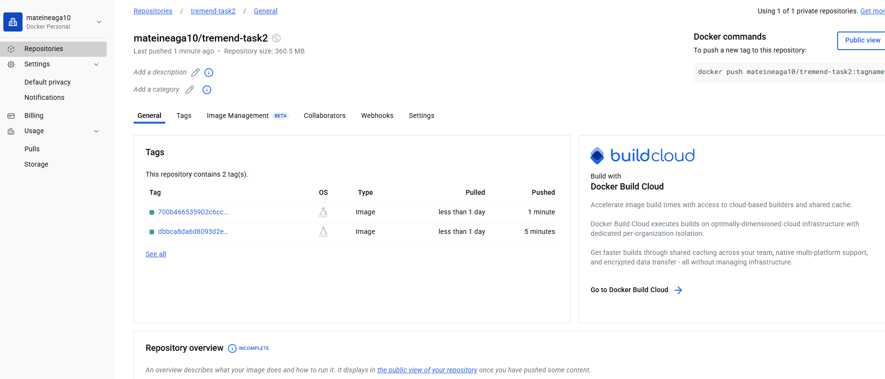

## Task 2 - Dockerized application CI/CD

## 1. Choose an application

For this task I chose the javascript application, which is a simple note manager.

---

## 2. Create a Dockerfile

Dockerfile created on a node base image, bullseye being the most stable and easy to set up. The internal port of the application 8080 is exposed and mapped to external port 8080.

```
FROM node:19-bullseye

WORKDIR /app

COPY . ./

EXPOSE 3000

RUN npm install

RUN npm install express

CMD ["node", "notes.js"]
```

---

## 3. Local Testing

I created a "docker-compose.yml" file, to build the local Dockerfile image and to auto map the ports 8080 to 3000. The condition to work, is to store this "docker-compose.yml" file in the same directory with "Dockerfile", or else the "build: ." line should be modified with the path of the Dockerfile.

```
services:
  tremend:
    build: .
    ports:
      - "8080:8080"
```


```
vagrant@ubuntu-jammy:~/Internship-Resources-2025/2-app$ docker images
REPOSITORY      TAG       IMAGE ID       CREATED          SIZE
2-app-tremend   latest    c766356b2989   43 seconds ago   1GB
ubuntu          latest    a04dc4851cbc   7 weeks ago      78.1MB
vagrant@ubuntu-jammy:~/Internship-Resources-2025/2-app$ docker ps
CONTAINER ID   IMAGE           COMMAND                  CREATED          STATUS          PORTS                                         NAMES
9565c683b43f   2-app-tremend   "docker-entrypoint.s…"   45 seconds ago   Up 44 seconds   0.0.0.0:8080->8080/tcp, [::]:8080->8080/tcp   2-app-tremend-1
```

Verification that the app is working properly on local


---

## Bonus

Environment variables (PORT) was passed to file ".env" to be used in the "notes.js" script. To do so, I added a package "dotenv" to the server, just to be able to import the environment variables passed.

For proving the goal of this task, the file containing environment variables was not hidden. Otherwise, I would add ".env" to a file ".gitignore".

---

## Personal bonus

I completed an additional exercise. I deployed the Docker image created within the pipeline to a Kubernetes cluster hosted on Minikube. The application is hosted in a deployment consisting of a single replica, which is attached to a NodePort service to make it accessible from outside the local cluster. The file used to deploy this configuration is "k8s-node-app.yaml"





